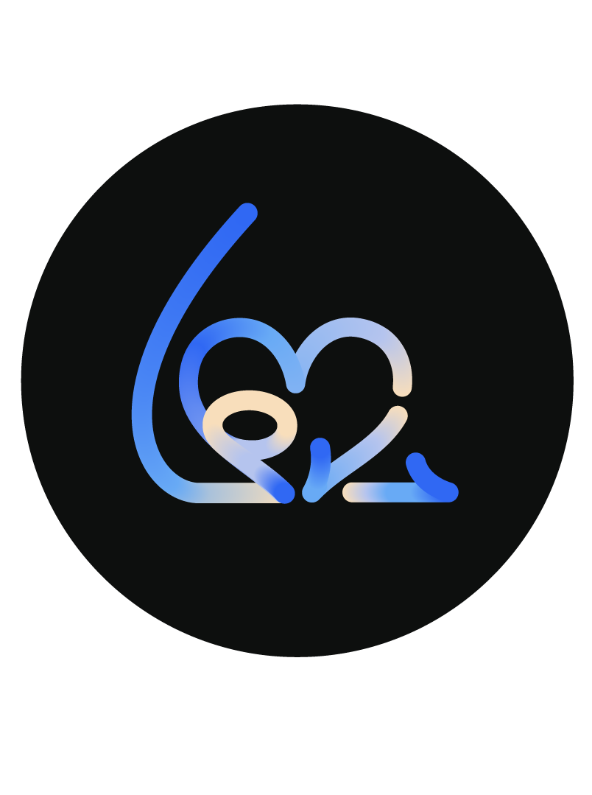
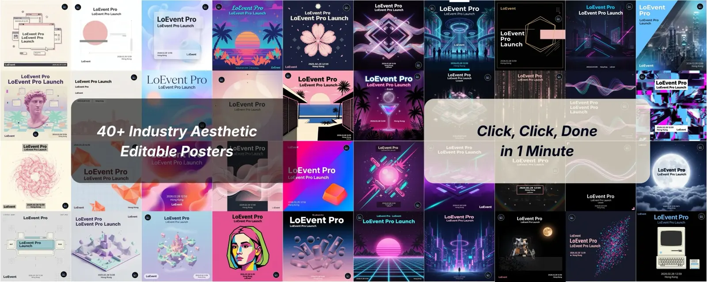
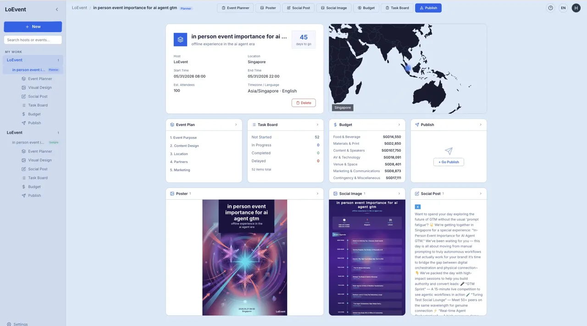
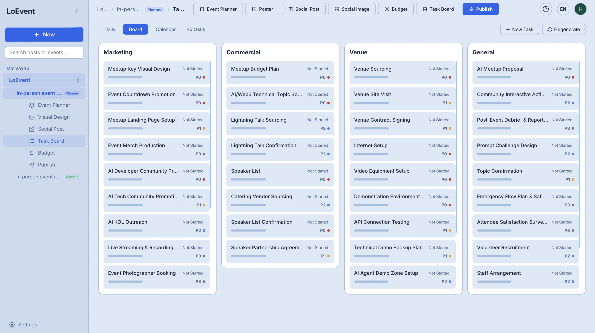

<p align="center">
  
</p>

<h1 align="center">LoEvent — AI Event Planner</h1>

<p align="center">
  <strong>Click to plan. Click for growth. · 一键策划，一键增长。</strong><br>
  Open-source, agentic AI event planning for any coding agent —<br>
  Claude Code · Codex · Cursor · Gemini/Antigravity · any <code>SKILL.md</code>-compatible agent.<br>
  开源、可自托管的活动策划 AI 技能包，适配任意 AI 编码 agent（不绑定单一平台）。
</p>

<p align="center">
  <a href="#english">English</a> ·
  <a href="#简体中文">简体中文</a> ·
  <a href="https://www.loevent.com/pro">LoEvent Pro ↗</a>
</p>

<p align="center">
  
  
  
  
</p>

<p align="center">
  
  
</p>
<p align="center">
  
</p>
<p align="center"><em>40+ editable poster styles · full plan, budget & task board — all from one sentence. · 40+ 可编辑海报风格 · 完整方案·预算·任务看板，全部由一句话生成。</em></p>

---

<a id="english"></a>

## English

Describe an event in one sentence and your agent turns it into a **structured brief → audience profile → sponsor/competitor strategy → budget → prep timeline → guest bios → social posts → poster → a complete 6-chapter plan**. It runs **entirely on your own machine, with your own API key** — your event data never touches our servers.

> **This is the open-source, local sibling of [LoEvent Pro ↗](https://www.loevent.com/pro).** Pro is the hosted, one-click product with 40+ poster styles, a live task board, and team workspaces. This repo is the same planning brain as a **free, self-hosted skill pack you fully control** — bring your own model, keep your data local, extend it however you like.

### Try These Prompts

Just talk to your agent in plain language. No commands, no skill names to memorize.

**Start from scratch**
> "I'm running an AI-developer meetup in Singapore on Aug 31, ~60 people. Help me organize it."

**Build the strategy**
> "Who should this event target?"
> "Research the host and give me a few strategy directions with competitor benchmarking."

**Produce the assets**
> "Draft a prep timeline." · "Make a poster — minimalist style, 9:16." · "Write a warm-up post for our community." · "Turn all of this into a complete plan."

### Quick Start

**Prerequisites** — any `SKILL.md`-compatible coding agent ([Claude Code](https://claude.com/claude-code), Codex, Cursor, Gemini/Antigravity…) · Python 3.11+ · a **Gemini API key** ([Google AI Studio](https://aistudio.google.com/apikey)), or any OpenAI-compatible model (see [Use Any Model](#use-any-model)).

```bash
git clone https://github.com/loevent2025/loevent-event-planner.git
cd loevent-event-planner

python -m venv .venv && source .venv/bin/activate   # Windows: .venv\Scripts\activate
pip install -r requirements.txt

cp .env.example .env        # then edit .env and add your GEMINI_API_KEY
python engine/doctor.py     # self-check: key / text model / grounding / image tier
```

Open your coding agent (Claude Code shown) in this folder and just describe your event:
```
I'm hosting an AI product launch in Shanghai on Sep 20 for ~300 people,
host is XX Inc. Help me organize it.
```
Your agent builds the brief, then you keep going: *"do an audience profile" · "draft a budget" · "make a poster"*. It picks the right skill automatically and presents everything as readable text (never raw JSON).

### What You Get

13 skills, driven in plain language. Your agent auto-selects the right one:

| You say | It produces |
|---|---|
| "How do I use this? / Where do I start?" | An onboarding map (main line + what each skill outputs) |
| "I'm running an AI conference in Sept, help me organize it" | A structured event brief (the starting point for everything else) |
| "Who should this target?" | Audience profile (primary / secondary / extended + pain points) |
| "What trends can we ride?" | Industry trends / hot topics / audience pain-point research |
| "Research the host, give me strategy directions" | Host research + competitor benchmarking + **3 differentiated strategy directions** |
| "Roughly how much will this cost?" | Itemized budget (low / high estimate + category rollup) |
| "Draft a prep plan" | Back-planned timeline (tasks + start/end dates + P0–P3 priority) |
| "Introduce this guest / this host" | Grounded, fact-checked guest bio / company profile |
| "Write a post for X / a community group" | Platform-native social copy |
| "Draft a launch announcement" | Luma-style long/short copy + headline |
| "Make a poster" / "edit the text on it" | Poster in a chosen style; optionally erase-and-re-typeset editable text |
| "Turn this into a complete plan" | A full **6-chapter event plan**, saved as `eventplan_full.md` |

### The Main Line (How It Works)

```
  init ──▶ audience ──▶ event-strategy ──▶ ( pick 1 of 3 strategy cards ) ──▶ eventplanner
 (brief)  (who + why)  (host + competitors,        ↑ your call, informed        (full 6-chapter
                        3 strategy directions)        by full research)            plan → .md)

  side skills, anytime:  trends · budget · timeline · guest bios · host bio · social · launch copy · poster
```

1. **Brief** — one sentence in, a structured `event.json` / `host.json` / `plan.json` out.
2. **Audience** — who this is for and their real pain points.
3. **Event Strategy** — deep-researches the host + benchmarks competitors, then hands you **three differentiated directions** (brand-DNA / competitor-diff / trend-forward) with full research to choose from.
4. **Event Plan** — synthesizes the chosen direction into a complete plan (goals & background, content, venue, partnerships, marketing) — saved as a full `.md`.

Every skill shares a local working directory (`plan.json`) to pass context along. Nothing leaves your machine except the model API calls you make.

### Use Any Model

Can't use Gemini? The entire suite runs on **any OpenAI-compatible model** — just change a few `.env` variables. The skill code doesn't change.

```bash
# Text (all text skills) — GLM shown as example
LOEVENT_TEXT_PROVIDER=glm
LOEVENT_TEXT_MODEL=glm-4.6
LOEVENT_TEXT_API_KEY=your-key

# Web research (trends / guests / host / budget) — non-Gemini has no built-in search, so add one
LOEVENT_SEARCH_PROVIDER=tavily           # tavily / bocha — pick either (both have free tiers)
LOEVENT_SEARCH_API_KEY=your-key

# Poster image generation (only if you want posters)
LOEVENT_IMAGE_PROVIDER=openai            # openai (gpt-image) / doubao (4K) / cogview (free tier)
LOEVENT_IMAGE_MODEL=your-model
LOEVENT_IMAGE_API_KEY=your-key
```

- **Officially validated:** Gemini and GLM. Everything else is *"API-compatible, verify it yourself."*
- Set nothing and it defaults to Gemini. Full field reference in [`.env.example`](./.env.example).
- You can also just tell your agent **"I want to use a different model"** and it'll walk you through the setup (Claude Code shows a picker; other agents ask in text).

<details>
<summary><strong>Full provider matrix (text · search · image · edit · OCR)</strong></summary>

| Layer | Env prefix | Presets | Notes |
|---|---|---|---|
| **Text** | `LOEVENT_TEXT_*` | glm · kimi · deepseek · qwen · ernie · doubao · minimax · openai | Any OpenAI-compatible `base_url` also works (direct or via OneAPI/OpenRouter) |
| **Web search** | `LOEVENT_SEARCH_*` | bocha · tavily | Required for research skills on non-Gemini models (no silent hallucination) |
| **Image (text→image)** | `LOEVENT_IMAGE_*` | doubao · cogview · openai | Poster generation |
| **Image edit / erase** | `LOEVENT_IMAGE_EDIT_*` | qwen (`qwen-image-edit`) | Optional; the erase step of editable poster text. Falls back to Gemini; erase requires an image API (no local fallback) |
| **OCR / text locate** | `LOEVENT_OCR_*` | qwen-vl · glm-4v | Optional; locate poster text when Google Vision isn't available |

With all five configured, the whole pipeline runs **without touching Google**.
</details>

### Why LoEvent Skills?

- **Local-first & private** — event data lives only in your working directory; it never passes through LoEvent or any third-party server.
- **Your key, your cost** — every call uses your own API key.
- **Model-agnostic** — Gemini, GLM, DeepSeek, Kimi, doubao… swap with env vars, zero code changes.
- **Grounded, not made-up** — research skills require real web search; without one, they stop rather than invent sources.
- **Complete deliverables** — long outputs (full plans, strategy research) are written to `.md` files in full — never silently summarized.
- **Extend it freely** — MIT licensed; each skill is a `SKILL.md` + a Python script you can read and adapt.

### Agent Compatibility · Testing · Contributing

**Agent-agnostic — not locked to one platform.** Runs on any `SKILL.md`-compatible coding agent. **Claude Code** auto-triggers skills from each `SKILL.md`; the cross-agent contract in [`AGENTS.md`](./AGENTS.md) lets **Codex, Cursor, Gemini/Antigravity, Aider** and other agents pick and run them too.

```bash
pip install -r requirements-dev.txt
pytest -q        # fully offline / no-key
```

Adding a model provider is usually **one line** in `engine/providers/presets.py` plus env vars; adding a skill is a `skill-<name>/SKILL.md` + a `scripts/run.py`. Read [`AGENTS.md`](./AGENTS.md), then open an issue or PR.

**License** — [MIT](./LICENSE) © 2026 Gencosmo

---

<a id="简体中文"></a>

## 简体中文

一句话描述你的活动，你的 agent 就把它变成 **结构化档案 → 受众画像 → 主办方/竞品策略 → 预算 → 筹备时间线 → 嘉宾简介 → 社媒文案 → 海报 → 一份完整的 6 章节策划方案**。全程**在你自己电脑上运行，用你自己的 API Key**——活动数据不经过我们的服务器。

> **这是 [LoEvent Pro ↗](https://www.loevent.com/pro) 的开源本地版。** Pro 是托管的一键产品:40+ 海报风格、实时任务看板、团队协作空间。本仓库是**同一套策划大脑**,以**免费、可自托管、你完全掌控**的技能包形式提供——自带模型、数据留本地、想怎么扩展都行。

### 试试这些提示

像跟人说话一样对你的 agent 讲需求即可。不用敲命令、不用记技能名。

**从零开始**
> "我 8 月 31 号要在新加坡办一场 AI 开发者 meetup,大概 60 人,帮我组织一下。"

**搭策略**
> "这场活动该面向谁?" · "研究下主办方,给我几套策略方向,顺便对标竞品。"

**产出物料**
> "排一个筹备时间线。" · "做张海报——极简风,9:16。" · "给社群写条预热文案。" · "把这些落成一份完整方案。"

### 快速开始

**准备** —— 任意 `SKILL.md` 兼容的编码 agent（[Claude Code](https://claude.com/claude-code)、Codex、Cursor、Gemini·Antigravity…）· Python 3.11+ · 一个 **Gemini API Key**([Google AI Studio](https://aistudio.google.com/apikey)),或任意 OpenAI 兼容模型(见 [用任意模型](#用任意模型))。

```bash
git clone https://github.com/loevent2025/loevent-event-planner.git
cd loevent-event-planner

python -m venv .venv && source .venv/bin/activate   # Windows: .venv\Scripts\activate
pip install -r requirements.txt

cp .env.example .env        # 然后编辑 .env,填入你的 GEMINI_API_KEY
python engine/doctor.py     # 自检:Key / 文本模型 / 联网搜索 / 图像档
```

在这个文件夹里打开你的编码 agent(以 Claude Code 为例),直接描述你的活动:
```
我打算 9 月 20 日在上海办一场面向 AI 开发者的产品发布会,
主办方是 XX 公司,预计 300 人,帮我整理一下。
```
你的 agent 会先建档,之后你想做什么就接着说:*"做个受众画像" · "出个预算" · "做张海报"*。它会自动挑合适的技能,并把结果整理成好读的中文(不甩原始 JSON)。

### 你能让它做什么

13 个技能,用大白话驱动。你的 agent 自动挑对应的那个:

| 你说 | 它帮你 |
|---|---|
| "怎么用?/ 从哪开始?" | 一张上手地图(主线流程 + 各功能能产出什么) |
| "我 9 月要办一场 AI 大会,帮我整理一下" | 结构化活动档案(后续所有技能的起点) |
| "这场该面向谁?" | 目标受众画像(主要 / 次要 / 延伸 + 痛点) |
| "有什么趋势能蹭?" | 行业趋势 / 话题热点 / 受众痛点调研 |
| "研究下主办方,给几套策略方向" | 主办方调研 + 竞品对标 + **3 套差异化策略方向** |
| "大概要花多少钱?" | 分项预算(低估 / 高估 + 类别汇总) |
| "帮我排个筹备计划" | 倒排期时间线(任务 + 起止日期 + P0–P3 优先级) |
| "介绍下这位嘉宾 / 这家主办方" | 联网调研 + 核查后的嘉宾简介 / 公司简介 |
| "写条 X / 社群推文" | 对应平台的社媒文案 |
| "出一段活动发布文案" | Luma 风格的长短文案 + 标题 |
| "做张活动海报" / "把海报上的字改一下" | 按选定风格出海报;还可消字后让文字可编辑重排 |
| "把这场活动落成完整方案" | 一份完整的 **6 章节策划方案**,存成 `eventplan_full.md` |

### 主线怎么跑

```
  建档 ──▶ 受众 ──▶ 活动策略 ──▶ ( 从 3 套策略卡里选 1 张 ) ──▶ 完整方案
 (档案)  (谁+为何)  (主办方+竞品,        ↑ 你来定,基于完整调研       (6 章节完整
                     出 3 套策略方向)         做 informed 决策)          方案 → .md)

  支线,随时点:  趋势 · 预算 · 时间线 · 嘉宾简介 · 主办方简介 · 社媒 · 发布文案 · 海报
```

1. **建档** —— 一句话进,结构化的 `event.json` / `host.json` / `plan.json` 出。
2. **受众** —— 这场为谁办、他们真正的痛点是什么。
3. **活动策略** —— 深调研主办方 + 对标竞品,给你**三套差异化方向**(品牌传承 / 市场差异化 / 趋势前瞻),带完整调研供你选。
4. **完整方案** —— 把你选的方向综合成一份完整方案(目标背景、内容设计、场地、合作赞助、营销推广)——存成完整 `.md`。

所有技能共用一个本地工作目录(`plan.json`)传上下文。除了你自己发起的模型 API 调用,没有任何东西离开你的电脑。

### 用任意模型

想用 Gemini 以外的模型?整套技能可以跑在**任意 OpenAI 兼容模型**上——只改 `.env` 里几个变量,技能代码零改动。

```bash
# 文本(所有纯文本技能)——以 GLM 为例;换 base_url 即可对接任意供应商
LOEVENT_TEXT_PROVIDER=glm
LOEVENT_TEXT_MODEL=glm-4.6
LOEVENT_TEXT_API_KEY=你的key

# 联网调研(趋势/嘉宾/主办方/预算)——非 Gemini 没内置搜索,需配外部搜索
LOEVENT_SEARCH_PROVIDER=tavily           # tavily / bocha 任选(都有免费额度)
LOEVENT_SEARCH_API_KEY=你的key

# 海报出图(只想做海报才需要)
LOEVENT_IMAGE_PROVIDER=openai            # openai(gpt-image)/ doubao(4K)/ cogview(免费档)
LOEVENT_IMAGE_MODEL=你的模型名
LOEVENT_IMAGE_API_KEY=你的key
```

- **官方实测背书:** Gemini、GLM;其余各家是*"理论兼容,自行验证"*。
- 不配就默认走 Gemini。完整字段见 [`.env.example`](./.env.example)。
- 也可以直接跟你的 agent 说**"我想换别的模型"**,它会引导你填这几项(Claude Code 弹选择框,其它 agent 用文本问)。

<details>
<summary><strong>完整供应商矩阵(文本 · 搜索 · 图像 · 消字 · OCR)</strong></summary>

| 层 | 环境变量前缀 | 内置 preset | 说明 |
|---|---|---|---|
| **文本** | `LOEVENT_TEXT_*` | glm · kimi · deepseek · qwen · ernie · doubao · minimax · openai | 任意 OpenAI 兼容 `base_url` 也行(直连或经 OneAPI/OpenRouter) |
| **联网搜索** | `LOEVENT_SEARCH_*` | bocha · tavily | 非 Gemini 的调研类技能必需(避免无来源编造) |
| **文生图** | `LOEVENT_IMAGE_*` | doubao · cogview · openai | 海报生成 |
| **图像编辑/消字** | `LOEVENT_IMAGE_EDIT_*` | qwen(`qwen-image-edit`) | 可选;海报文字可编辑的抹字用。不配则用 Gemini;抹字必须有图像 API(无本地兜底) |
| **OCR/文字定位** | `LOEVENT_OCR_*` | qwen-vl · glm-4v | 可选;用不了 Google Vision 时估文字框 |

五层都配上,整条管线(文本/调研/出图/消字/定位)**全程不碰 Google**。
</details>

### 为什么用它?

- **本地优先、隐私** —— 活动数据只在你的工作目录,不经过 LoEvent 或任何第三方服务器。
- **你的 Key、你的成本** —— 所有调用走你自己的 Key。
- **模型无关** —— Gemini / GLM / DeepSeek / Kimi / 豆包… 换环境变量即可,零代码改动。
- **有据可循、不编造** —— 调研类技能必须联网搜索;没搜索就中止,而不是瞎编来源。
- **完整交付** —— 长产出(完整方案、策略调研)会**完整写成 `.md`**,绝不静默压缩成摘要。
- **自由扩展** —— MIT 许可;每个技能就是一段 `SKILL.md` + 一个可读可改的 Python 脚本。

### Agent 兼容性 · 测试 · 贡献

**Agent 无关——不绑定单一平台。** 跑在任意 `SKILL.md` 兼容的编码 agent 上。**Claude Code** 会自动按各 `SKILL.md` 触发;[`AGENTS.md`](./AGENTS.md) 里的跨 agent 公约让 **Codex / Cursor / Gemini·Antigravity / Aider** 等也能挑并运行这些技能。

```bash
pip install -r requirements-dev.txt
pytest -q        # 全离线 / 无需任何 Key
```

加一家模型供应商通常就是在 `engine/providers/presets.py` 加**一行** + 填环境变量;加一个技能就是 `skill-<名字>/SKILL.md` + 一个 `scripts/run.py`。先读 [`AGENTS.md`](./AGENTS.md),再开 issue 或 PR。

**License** —— [MIT](./LICENSE) © 2026 Gencosmo

---

<p align="center">
  <strong>From one sentence to a complete event plan — on your machine, with your model.<br>从一句话到一份完整活动方案 —— 在你的电脑上，用你的模型。</strong><br>
  <a href="https://www.loevent.com/pro">Want the hosted, one-click version? · 想要托管的一键版? → LoEvent Pro</a>
</p>
